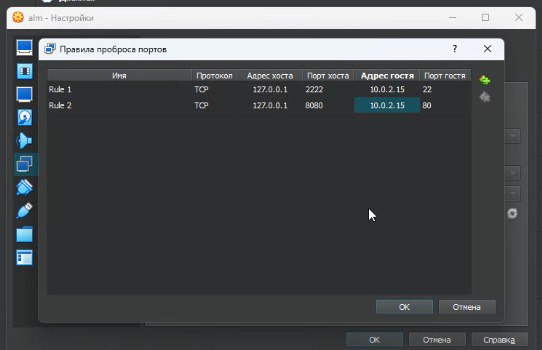

## Курс: Технология OpenStack. Основы программирования и конфигурирования.  
## Группа: Анциферова Татьяна, Ахметжанов Ренат, Корчагина Дарья, Резванов Владислав  
## Лабораторная работа 1   
## Дата создания: 28.02.2024  
---
# Подготовка к развертыванию OpenStack
## Введение
Облачная платформа OpenStack имеет ряд требований к окружению, необходимому для её функционирования. Так, большинство сервисов OpenStack используют базу данных SQL для хранения информации. В ней хранятся данные пользователей, проектов, информация о точках входа в модули, информация о запущенных машинах, созданных сетях и образах. База данных обычно располагается на управляющем узле.

Платформа OpenStack имеет набор интерфейсов для взаимодействия c системой со стороны пользователя. В данной работе рассмотрен command line interface (CLI) и модуль Horizon. Рассмотрены возможности авторизации в системе, создания проектов и пользователей.
## Ход работы
### 1.Создаем ВМ в VirtualBox на базе образа Alma Linux3
Установлен VirtualBox, ВМ создана и сконфигурирована на 4 GB ОЗУ, ЦПУ 3 диск 22 GB,настроена сеть NAT,запущен процесс установки.
Записан IP адрес ВМ:


Настроен проброс портов:



### 2.Подключаемся к ВМ по SSH (по адресу 127.0.0.1 порт 2222)

Результат:


### 3.Устанавливаем git: 
```
dnf install git -y
```
### 4.Клонируем себе проект:
```
git clone https://gitlab.com/itmo_samon/openstack_lab.git
```
### 5.Выполняем
```
./prepare.sh
```
Результат:


### 6.Изучаем скрипт config.sh
Выполняем
```
./config.sh
```
Результат:


### 7.Устанавливаем OpenStack
```
packstack --answer-file=answer.cfg
```


Успешное завершение установки:


### 8.Смотрим на сгенерированные данные для входа (логи,пароль)
```
cat ~/keystonerc_admin
```
Результат:


### 9.Передаем данные для входа в переменные среды
```
source ~/keystonerc_admin
```
### 10.Получаем список эндпоинтов для сервисов Openstack
```
openstack endpoint list
```
Результат:


### 11.Изучаем вывод
```
openstack user list
```
### 12.Изучаем вывод
```
openstack project list
```


### 13. Выполняем команду
```
openstack project create --domain default --description "Demo Project" demo
```


### 14.Изучаем вывод
```
openstack project list
```


### 15.Подключаеся к веб-панели (Horizon) через браузер 
Переходим на [http://localhost:8080](http://localhost:8080)  и вводим данные для входа из файла
```
keystonerc_admin
```
### 16.Создаем проект и пользователя проекта в интерфейсе Horizon (меню слева, Администрирование)
Результат:


### 17.Добавляем созданному пользователю роль в проекте (_member_)
Результат:


Все пользователи проекта:


### 18.Выходим из системы и авторизоваемся под созданным пользователем
Результат:


