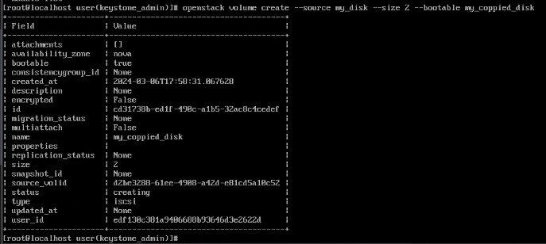

## Курс: Технология OpenStack. Основы программирования и конфигурирования.  
## Группа: Анциферова Татьяна, Ахметжанов Ренат, Корчагина Дарья, Резванов Владислав  
## Лабораторная работа 2   
## Дата создания: 08.03.2024  
---
# Network, Storage, Server. Создание ВМ.
## Ход работы
### 1.Активируем переменные окружения для корректной авторизации в Keystone под учетной записью пользователя admin.
```
source /root/keystonerc_admin
```


### 2.Создаем сеть провайдера.
Используем команду:
```
openstack network create --external --default --provider-network-type flat --provider-physical-network br-ex my_public_network
```
В данной команде содержится в качестве параметра поле provider-network-type, которое соответствует внутреннему названию виртуального коммутатора br-ex на базе Open vSwitch (т.е. в системе имеется коммутатор br-ex, соответствующий названию extnet в OpenStack). Тип сети установлен в значение flat, так как отсутствует сегментация по VLAN/GRE/VXLAN со стороны сети VirtualBox```

Результат:


### 3.Создаем подсеть в сети провайдера.
Последовательность следующих команд выполняет данные действия:
```
IP=`/sbin/ip route | awk '/default/ { print $3 }'`
baseIP=`echo $IP | cut -d"." -f1-3`
openstack subnet create --allocation-pool start=$baseIP.50,end=$baseIP.60 --no-dhcp --subnet-range $baseIP.0/24 --gateway $IP --network my_public_network --dns-nameserver 1.1.1.1 my_public_subnet
```
Выполняется в несколько шагов, т.к. необходимо получить параметры интерфейсов, подключенных к сети VirtualBox и установить соответствующие параметры. В качестве шлюза должен быть назначен тот же шлюз, что и в созданной ВМ, подсеть также должна совпадать, диапазон может быть выбран произвольный (не пересекающийся с имеющимися адресами).

Результат:


### 4.Создаем локальную сеть и подсеть.
На данном шаге создаётся виртуальная сеть платформы OpenStack для выделения адресов ВМ:
```
openstack network create --internal my_private_network
openstack subnet create --subnet-range 172.17.22.0/24 --network my_private_network --dns-nameserver 1.1.1.1 my_private_subnet
```
Результат:


### 5.Создаем роутер и подключаем созданные сети.
Данный шаг необходим для обеспечения маршрутизации трафика между виртуальной сетью OpenStack и сетью провайдера:
```
openstack router create --external-gateway my_public_network my_router
openstack router add subnet my_router my_private_subnet
```
Результат:


### 6.Создаем флейвор виртуальной машины.
При запуске ВМ необходимо выбрать её размер. Данная команда создаёт ограничение по оперативной памяти в 256МБ:
```
openstack flavor create --ram=256 my_tiny_flavor
```
Результат:


### 7.Создаем ключ доступа.
В дальнейшем можно будет подключиться с данного компьютера по SSH к ВМ без пароля, используя закрытый ключ:
```
openstack keypair create --public-key ~/.ssh/id_rsa.pub my_key
```

### 8.Загружаем образ Cirros в OpenStack Glance.
Образ скачивается с официального сайта и обладает минимальным набором пакетов. Образ имеет формат qcow2, система уже развернута в данный образ и готова к запуску. 
Предварительно требуется установка пакета wget.
```
wget http://download.cirros-cloud.net/0.6.2/cirros-0.6.2-x86_64-disk.img
```
Результат:


```
openstack image create --disk-format qcow2 --public --file ./cirros-0.6.2-x86_64-disk.img my_cirros_image
```
Результат:


### 9.Создаем блочное устройство в Cinder.
В качестве параметров указываем размер, имя и источник (ранее созданный образ). Флаг --bootable обозначает диск с ОС (загрузочный):
```
openstack volume create --size 2 --image my_cirros_image --bootable my_disk
```

### 10.Переходим в панель Horizon и создаем виртуальную машину.
Параметры машины:
- имя Our_instance
- источник: ранее созданный диск
- флейвор: созданный ранее
- сеть: ранее созданная приватная
Результат:
1.


2.


3.


4.

### 11.Переходим в «Консоль».
После успешного запуска выбираем в выпадающем списке (справа от ВМ) пункт «Консоль», на открывшейся странице нажимаем кнопку «Нажмите сюда для показа только консоли». На открывшейся странице изменяем адрес гостевой машины на адрес хоста (`10.0.2.15` на `127.0.0.1`). До этого производим проброс порта 6080 ВМ:

 

Переход в консоль инстанса:

 
### 12.Проверка адреса ВМ в консоли
Проверка выполнена успешно, ВМ получила валидный адрес (не 169.x.x.x):


## Задание
### 1.Через Horizon создаем еще одну приватную сеть+подсеть, подключаем ее к уже существующему роутеру
1.


2.

### 2.Через Openstack CLI создаем копию ранее созданного блочного устройства
```
openstack volume create --sourse my_disk --size 2 --bootable my_coppied_disk
```


### 3.Через Openstack CLI создаем еще одну ВМ.
Параметры машины:
- имя my_new_vm
- источник: созданная копия диска
- флейвор: созданный ранее 
- сеть: новосозданная приватная
```
openstack server create --flavor my_tiny_flavor --image my_coppied_disk --nic net-id=our_private_nrtwork my_new_vm
```

### 4.Через Horizon проверяем, что все завелось
Результат:


## Вопросы:
### 1.Что именно сервис с помощью Keystone проверяет в токене пользователя, когда тот пытается осуществить операцию по отношению к этому сервису?

### 2.При создании ВМ, Nova первым делом идет в Keystone, проверяет токен и т.д. Как думаете, к эндпоинту какого сервиса Nova идет следом?
