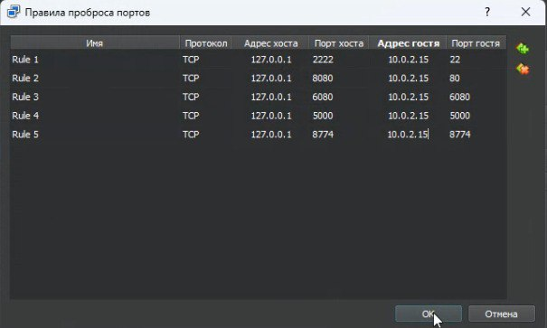
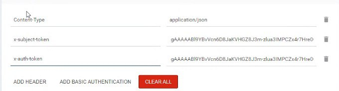
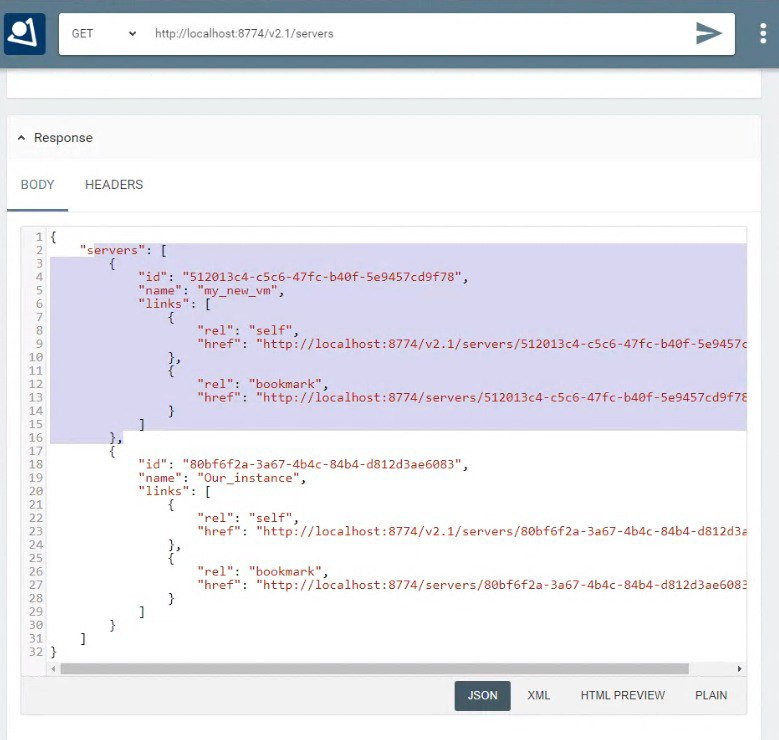
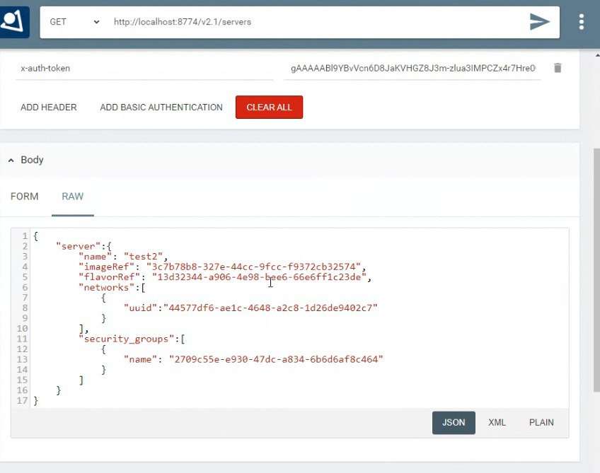
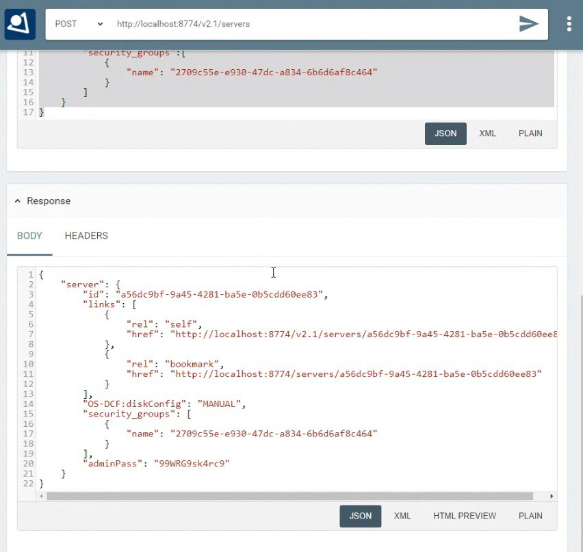
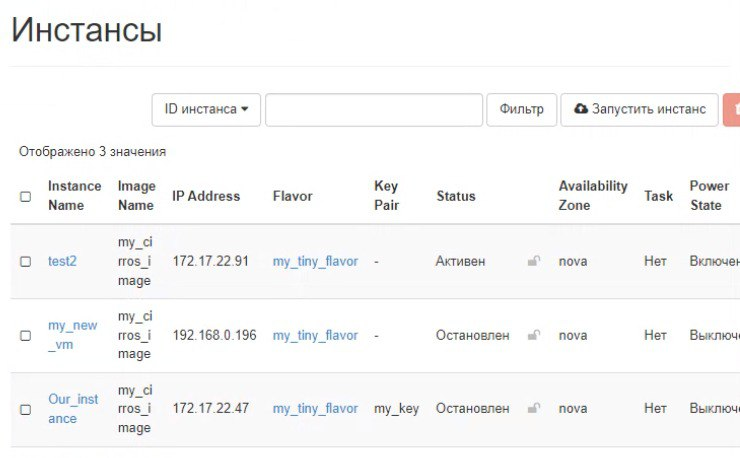
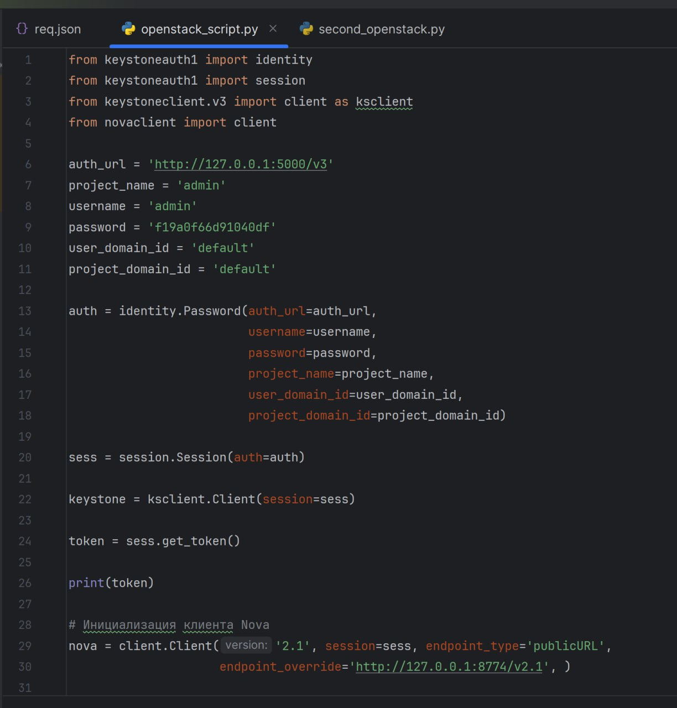
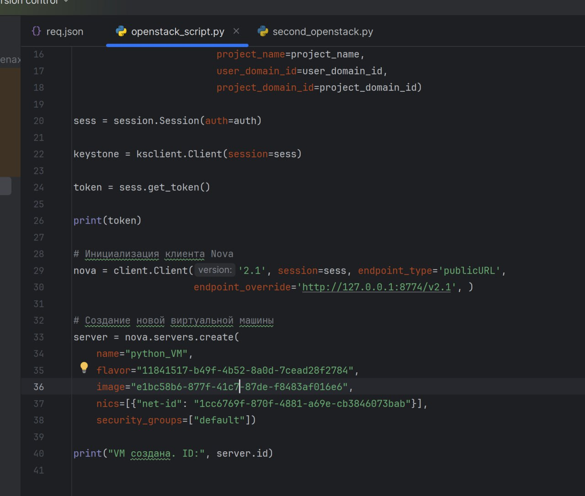
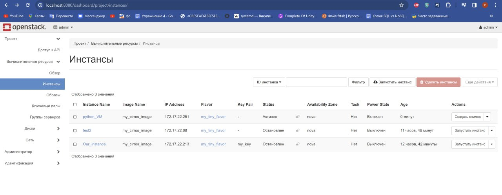
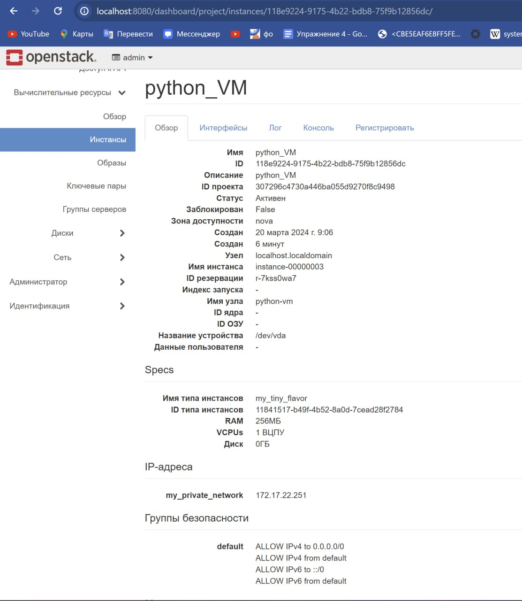

## Курс: Технология OpenStack. Основы программирования и конфигурирования.  
## Группа: Анциферова Татьяна, Ахметжанов Ренат, Корчагина Дарья, Резванов Владислав  
## Лабораторная работа 3  
## Дата создания: 17.03.2024  
---
# Работа с Openstack API
## Ход работы
### 1.Пробрасываем 5000 и 8774 порты для дальнейшей работы.



### 2.Запрашиваем у Keystone токен для дальнейшей работы. Нужное значение лежит в заголовке (header)- x-subject-token.
Для обращения к API используем расширение для браузера  [RestMan](https://chromewebstore.google.com/detail/restman/ihgpcfpkpmdcghlnaofdmjkoemnlijdi).   
Обращаемся к API Keystone по ссылке, запрос POST:  [https://localhost:5000/v3/auth/tokens](https://localhost:5000/v3/auth/tokens).  


Используем аутентификацию по паролю с указанием скоупа (в нашем случае project = admin):

```
  "auth": {
    "identity": {
      "methods": [
        "password"
      ],
      "password": {
        "user": {
          "name": "admin",
          "domain": {
            "id": "default"
          },
          "password": "4a1e531917dc4365"
        }
      }
    },
    "scope": {
      "project": {
        "name": "admin",
        "domain": {  "id": "default"  }
      }
    }
  }
}
```
### 3. Проверяем, что токен рабочий: запрашиваем эндпоинт Nova (просматриваем существующие ВМ), передав в заголовках полученный x-subject-token и x-auth-token (они идентичны).
Передаем токены:



Обращаемся к API Nova по ссылке, запрос GET:  [https://localhost:8774/v2.1/servers](https://localhost:8774/v2.1/servers).  


Получаем существующие виртуальные машины:



### 4. Создаем новую ВМ через Nova API (порт 8774).

Обращаемся к API Nova по ссылке, запрос POST:  [https://localhost:8774/v2.1/servers](https://localhost:8774/v2.1/servers).  

Пишем запрос:
```
 {
  "server":{
    "name": "test2",
    "imageRef": "3c7b78b8-327e-44cc-9fcc-f9372cb32574",
    "flavorRef": "13d32344-a906-4e98-bee6-66e6ff1c23de",
    "networks":[
      {
        "uuid":"44577df6-ae1c-4648-a2c8-1d26de9402c7"
      }
    ],
    "security_groups":[
      {
        "name": "2709c55e-e930-47dc-a834-6b6d6af8c464"
      }
    ]
  }
}
```



Получаем:



В результате видим новую ВМ - test2 в списке наших виртуальных машин:



## Задание
### Повторяем операцию по созданию ВМ  через API, но с помощью “обертки” (SDK): Python.
Пишем скрипт, в котором воспроизводим авторизацию и создание ВМ:
```
from keystoneauth1 import identity
from keystoneauth1 import session
from keystoneclient.v3 import client as ksclient
from novaclient import client

auth_url = 'http://127.0.0.1:5000/v3'
project_name = 'admin'
username = 'admin'
password = 'f19a0f66d91040df'
user_domain_id = 'default'
project_domain_id = 'default'

auth = identity.Password(auth_url=auth_url,
                         username=username,
                         password=password,
                         project_name=project_name,
                         user_domain_id=user_domain_id,
                         project_domain_id=project_domain_id)

sess = session.Session(auth=auth)

keystone = ksclient.Client(session=sess)

token = sess.get_token()

print(token)

# Инициализация клиента Nova
nova = client.Client('2.1', session=sess, endpoint_type='publicURL',
                     endpoint_override='http://127.0.0.1:8774/v2.1', )

# Создание новой виртуальной машины
server = nova.servers.create(
    name="python_VM",
    flavor="11841517-b49f-4b52-8a0d-7cead28f2784",
    image="e1bc58b6-877f-41c7-87de-f8483af016e6",
    nics=[{"net-id": "1cc6769f-870f-4881-a69e-cb3846073bab"}],
    security_groups=["default"])

print("VM создана. ID:", server.id)

```




Смотрим результат в Horizon:





## Вопросы:
### 1.Какие протоколы тунеллирования использует Neutron?
Neutron использует следующие протоколы туннелирования:   
1.GRE (Generic Routing Encapsulation) - обеспечивает механизм инкапсуляции для передачи пакетов между удаленными сетями.  
2.VXLAN (Virtual Extensible LAN) - позволяет создавать виртуальные сети на основе технологии Ethernet.  
3.Geneve - новый протокол туннелирования, который предоставляет возможность передачи метаданных и обеспечивает более гибкие опции конфигурации.

### 2.Можно ли заменить Cinder, например, CEPH-ом? Для чего если да, почему если нет?
Да, можно заменить Cinder на Ceph для хранения блочных данных. Ceph - распределенное хранилище данных с возможностью масштабирования и различными типами хранения (блочное, файловое, объектное),Cinder - блочное хранилище для виртуальных машин. Ceph более универсальный и отказоустойчивый, а Cinder ориентирован на работу с виртуальными машинами.
Ceph предоставляет более высокую доступность, отказоустойчивость и масштабируемость (Обычно как раз таки Cinder и заменяют на Ceph по этим причинам).


